# Máquina Casino
### Reconocimiento de la Ip de la máquina víctima

### Puertos abiertos

sudo nmap -sS --disable-arp-ping --min-rate 6000 -p- --open -vvv -Pn 10.0.2.30

### Servicios y versiones

sudo nmap -sVC --min-rate 6000 -p22,80 -vvv -Pn 10.0.2.30

### Fuzzing Web

feroxbuster --url http://10.0.2.30/ -w /usr/share/seclists/Discovery/Web-Content/big.txt

### Explotación

Al entrar en la web tienes que registrarte e iniciar sesión

luego te dan una cantidad de dinero para que puedas jugar, consumes todo el dinero y te llevara a un SSRF

Comprobando el SSRF

creé el archivo nums desde el 1 al 65535

Busqué puertos en la máquina casino accesibles desde el localhost.

Busqué directorios:

realizo un curl al subdirectorio codebreakers

encuentro un id_rsa

por la web lo visualizo

lo copié, le dí permisos 600 y lo guardé.

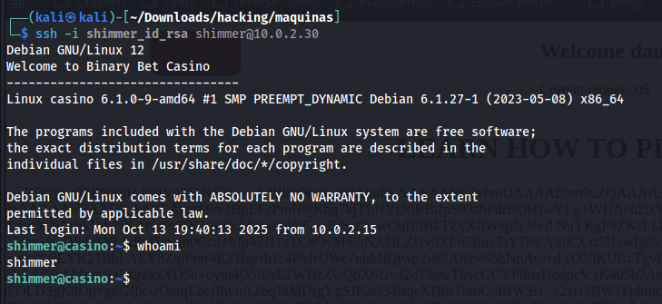

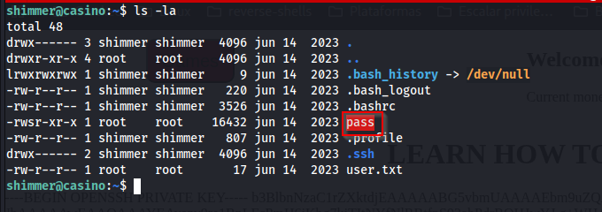

### Escalar privilegios

descargué el archivo y visualizo que tipo de archivo es:

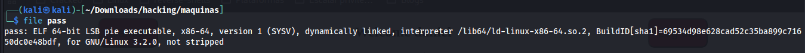

lo analicé con ghidra

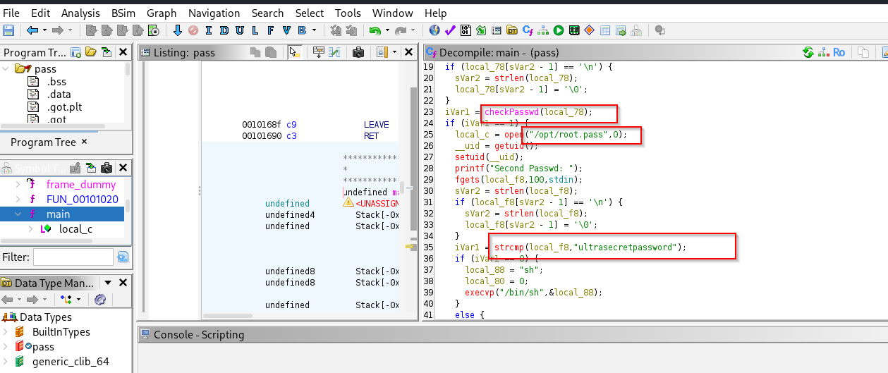

el binario pide 2 contreaseñas la primera contraseña debemos descifrar la 2da es ultrasecretpassword luego de eso se abrirá una shell de manera paralela se abrira el archivo /opt/root.pass y no se cerrará.

utilicé Ejecución simbólica:

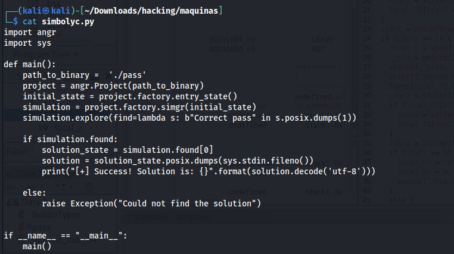

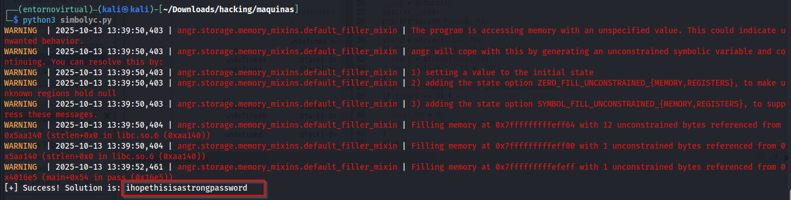

ejecuto el binario pass

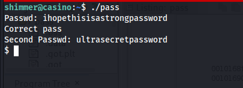

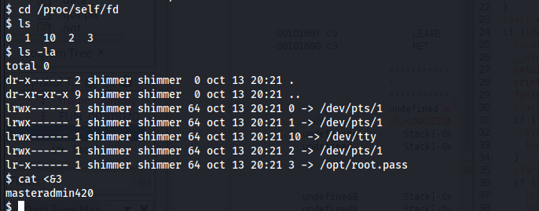

ejecuto su root y escribo la contraseña:

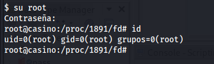

### user.txt

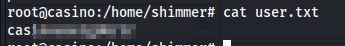

### root.txt

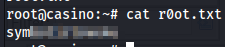