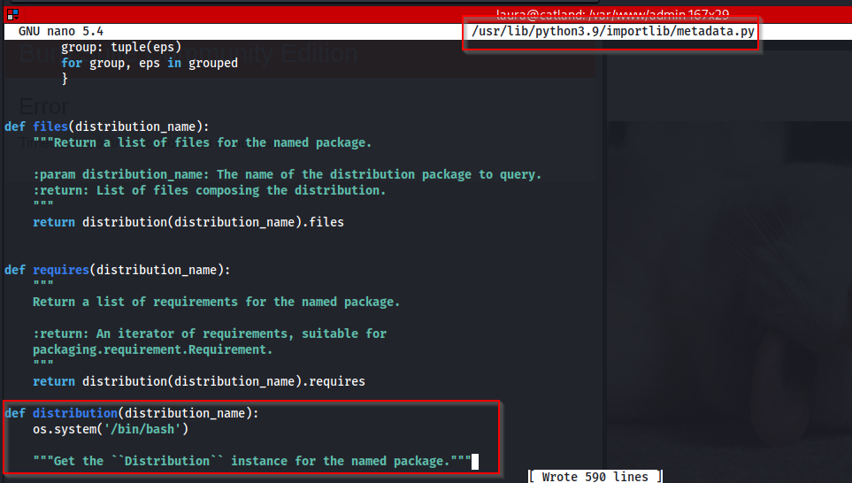
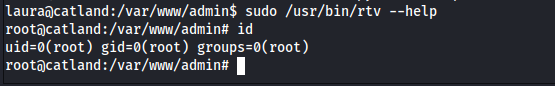
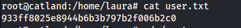
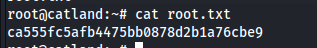

# Máquina Catland
### Reconocimiento de la Ip de la máquina víctima

agregamos el dominio al /etc/hosts

### Puertos abiertos

sudo nmap -sS --disable-arp-ping --min-rate 6000 -p- --open -vvv -Pn 10.0.2.26

### Servicios y versiones

sudo nmap -sVC --min-rate 6000 -p22,80 -vvv -Pn 10.0.2.26

### Fuzzing Web

feroxbuster --url http://catland.hmv/ -w /usr/share/seclists/Discovery/Web-Content/big.txt

haciendo ctrl + u: visualicé al usuario laura

busqué subdominios

wfuzz -H "Host: FUZZ.catland.hmv" -w /usr/share/wordlists/seclists/Discovery/DNS/subdomains-top1million-110000.txt -u http://catland.hmv --hw=97

lo agregué al /etc/hosts

Busqué archivos .php dentro del subdominio:

wfuzz -c --hc=404 --hl=6 -t 200 -w /usr/share/seclists/Discovery/Web-Content/big.txt  -z list,php-txt-md 'http://admin.catland.hmv/FUZZ.FUZ2Z'

### Explotación

al entrar al subdominio por la url, me redirige a catland.hmv, entonces lo intercepté con burpsuite y me salté el redirect

le doy en forward y elimino redirectToSubdomain();

y luego en forward otra vez, listo pude acceder

ahora para encontrar la contraseña, lo que hice fue utilizar la herramienta cupp

python3 cupp.py -i

me generó el archivo de contraseñas laura.txt

utilicé la herramienta ffuf para encontrar la contraseña:

ffuf -c -w laura.txt -H 'Content-Type: application/x-www-form-urlencoded' -u http://admin.catland.hmv/index.php -d "username=laura&password=FUZZ" -fs 1068

ingreso al sistema

le di clic en go

tiene pinta de LFI

tenemos al usuario laura

Previamente hicimos fuzzing al subdominio para encontrar archivos, y vimos el archivo upload.php

solo me deja subir archivos comprimidos en .rar o en .zip, entonces lo que hice fue subir un archivo .php comprimido a zip y luego concatenarlo con el LFI

lo subo:

la concatenación

me lanzo una reverse shell con busybox

hice tratamiento de la tty

ingresé a la base de datos y encontré lo siguiente:

entonces busqué archivos de grub:

usé el hash desde grub.pbkdf2.sha512.... hasta ...BBC y lo guardé como password_grub.txt y lo crackié con JohnTheRipper

john --wordlist=/usr/share/wordlists/rockyou.txt password_grub.txt

utilicé esa contraseña para cambiar al usuario laura

### Escalar privilegios

vi el tipo de archivo que era el binario

visualicé el archivo archivo rtv

busqué la librería y sus arcgivos y encontré metadata.py que tiene permisos de escritura:

modifiqué el archivo metadata.py y le agregué la siguiente línea de código:

luego:  

### user.txt

### root.txt

