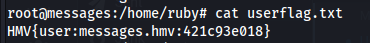
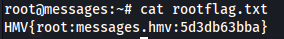

# Máquina Messages
### Reconocimiento de la Ip de la máquina víctima

### Puertos abiertos

sudo nmap -sS --disable-arp-ping --min-rate 6000 -p- --open -vvv -Pn 10.0.2.33

### Servicios y versiones

sudo nmap -sVC --min-rate 6000 -p22,25,80,110,143,443,465,587,993,995 -vvv -Pn 10.0.2.33

### Fuzzing Web

feroxbuster --url https://10.0.2.33/ -w /usr/share/seclists/Discovery/Web-Content/big.txt --insecure

### Explotación

Entré a la web:

vi la versión de chatbot y encontré el exploit

inicié sesión

una vez iniciada sesión aplico lo de este exploit que se trata de un RCE  https://www.exploit-db.com/exploits/50672

en Settings cargo un reverse_shell en php en Bot Avatar me pongo en escucha con netcat

en /var/www/html/chatbot encontré el archivo initialize.php

inicié sesión a la base de datos:

copie las contraseñas y las guardé en un archivo pass.txt´y luego crackié con johntheripper

inicié sesión con ruby@messages.hmv y la contraseña encontrada

en Inbox encontré un id_rsa que le pertenece a Ruby

lo copie y me conecté por ssh con el usuario ruby

### Escalar privilegios

### user.txt

### root.txt

